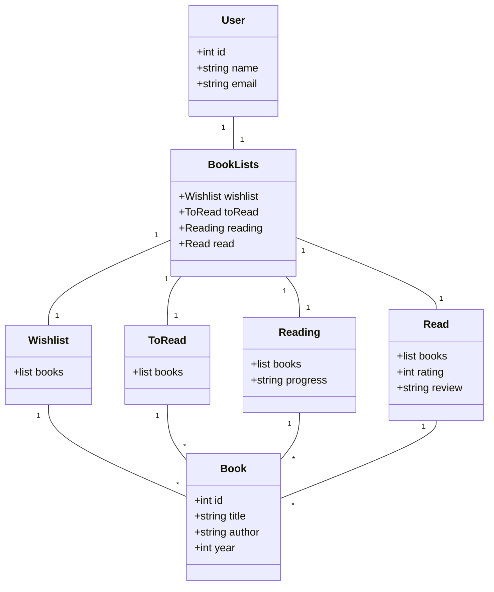

# ListadeLivros
API simples de um app com lista de leitura usando Java e Springboot 

Para criação do diagrama de classes foi utilizada a sintaxe mermaid

## Diagrama de classes 

```mermaid

classDiagram
    class User {
        +int id
        +string name
        +string email
    }

    class Book {
        +int id
        +string title
        +string author
        +int year
    }

    class Wishlist {
        +list<Book> books
    }

    class ToRead {
        +list<Book> books
    }

    class Reading {
        +list<Book> books
        +string progress
    }

    class Read {
        +list<Book> books
        +int rating
        +string review
    }

    class BookLists {
        +Wishlist wishlist
        +ToRead toRead
        +Reading reading
        +Read read
    }

    User "1" -- "1" BookLists
    BookLists "1" -- "1" Wishlist
    BookLists "1" -- "1" ToRead
    BookLists "1" -- "1" Reading
    BookLists "1" -- "1" Read
    Wishlist "1" -- "*" Book
    ToRead "1" -- "*" Book
    Reading "1" -- "*" Book
    Read "1" -- "*" Book
```
